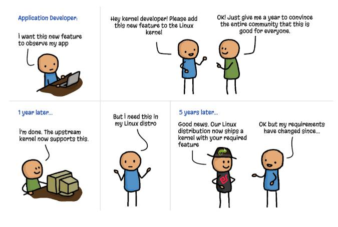
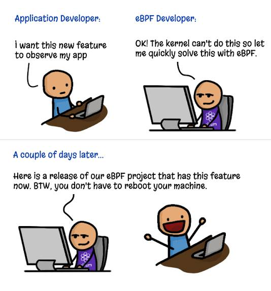

# eBPF မိတ်ဆက် - ၁

## ၁။ eBPF ဆိုတာဘာလဲ။
eBPF ဆိုတာ လွယ်လွယ်ပြောရရင် kernel နည်းပညာတစ်ခုပါ။ eBPF
program တွေရေး Kernel ထဲမှာ run ပြီး kernel တစ်ခုလုံး
အလုပ်လုပ်ပုံကိုပြောင်းလို့ရပါတယ်။ ဥပမာ Network flow က Host
OS ပေါ်က application တစ်ခုဆီဝင်လာတယ်ပဲထားပါစို့။ eBPF
program မပါတဲ့ Flow ကိုပဲအကြမ်းဖျင်းကြည့်ရရင် IP 10.2.2.1
ကနေ packet တစ်ခုရောက်လာမယ်။(ကျွန်တော်တို့က အဲဒီ IP က packet
တွေကို လက်မခံချင်ဘူး) Network Interface Card (NIC) က packet
ကိုရမယ်။ ပြီးတော့ Driver က sk_buff allocation လုပ်မယ်။
(sk_buff allocation ဆိုတာ လွယ်လွယ်ပြောရရင် network packet
နဲ့ သူနဲ့သက်ဆိုင်တဲ့ metadata တွေကို သိမ်းထားဖို့လုပ်တာပဲ။)
အဲသလို သိမ်းထားပြီး နောက်အဆင့်တွေမှာ လိုသလိုသုံးတာပေါ့ အဲဒီ
data တွေကို။ eBPF program attached လုပ်ထားတဲ့အချိန် 10.2.2
1 ကနေပဲ packet ဝင်လာတဲ့အခါမှာကျတော့ NIC ကိုရောက်တယ်
ဒါပေမယ့် sk_buff allocation မလုပ်ခင်မှာပဲ ကျွန်တော်တို့
eBPF program က စစ်ပြီးတော့ ဒီ IP ကနေ packet
လက်ခံလို့မဖြစ်ဘူးဆိုပြီး block လိုက်တယ်။ sk_buff allocation
မလုပ်လိုက်ရတဲ့အတွက် performance overhead လျော့သွားမယ်။

အပေါ်ကပြောခဲ့တဲ့ ဥပမာက ရှုပ်ပေမယ့် eBPF
နဲ့ဘာလုပ်နိုင်သလဲဆိုတာကို အထင်းသားမြင်စေနိုင်ပါတယ်။ eBPF က
networking ပဲမဟုတ်ပါဘူး။ Observability နဲ့ Security
ပိုင်းတွေမှာလည်းသုံးလို့ရပါတယ်။ ဥပမာ Cloudflare က Firewallimplement လုပ်တဲ့အခါမှာ eBPF ကိုသုံးထားသလို Datadog
လို observability toolတွေကလည်း eBPF ပေါ်မှာ အတိုင်းအတာ
တစ်ခုထိ အခြေခံထားပါတယ်။

## ၂။ Kernel ထဲကို function အသစ်ထည့်ခြင်း
အပေါ်က ဥပမာကိုကြည့်ရင် eBPF က Kernel အလုပ်လုပ်ပုံကို
ပြောင်းလဲလိုက်တယ် သို့မဟုတ် function အသစ်ထည့်လိုက်တဲ့
ပုံမျိုးပါပဲ။ ဒါပေမယ့် တခြားနည်းတွေနဲ့လည်း
ထည့်လို့ရတာပဲမလား။ ဘာလို့ eBPF ကသင့်တော်တာလဲ။

(က) Linux Kernel မှာ feature အသစ်လိုချင်ရင် Kernel Source
Code ကို ပြင်ရေးပြီး Patch ပို့၊ အဆင်ပြေလို့ merge
ပြီးရင်ရပါပြီ။ ဒါပေမယ့် Kernel မှာ ကိုယ့် patch တစ်ခုကို
လက်ခံဖို့ဆိုတာ အဆင့်ဆင့်ဖြတ်သန်းရတာမလို့
ထင်သလောက်မလွယ်ပါဘူး။ merge ခံရတယ်ပဲထားဦး company အများစုက
kernel ကို source code ကနေ compile ပြီးသုံးတာ ရှားပါတယ်။
Linux Distro တွေပဲ အသုံးများကြတာမို့ အဲဒီ Linux Distro
တွေမှာ ကျွန်တော်တို့လိုချင်တဲ့ feature
ပါလာဖို့ထပ်စောင့်ရပြန်ပါတယ်။ အဲ့တော့ ကျွန်တော်တို့က
အရေးတကြီးလိုအပ်နေချိန်မျိုးမှာ အဲ့လောက်စောင့်နေရရင်မအိုကေပါဘူး။

(ခ) Linux Kernel Module
ပထမနည်းကကြာတော့ မြန်တဲ့နည်းတော့ရှိပါတယ်။ အဲဒါကတော့ Linux
Kernel Module တွေပါပဲ။ Kernel Module တွေက ကိုယ်တိုင်ရေးပြီး
လိုအပ်သလို ဖြုတ်လို့တပ်လို့ရပါတယ်။ ဒါပေမယ့် ပြဿနာကတော့
crash မဖြစ်ဖို့နဲ့ Kernel ထဲမှာ run ရမှာဖြစ်လို့ safe
ဖြစ်ဖို့ပါပဲ။ Kernel Module Crash ဖြစ်ရင် Kernel crash
ဖြစ်ဖို့ပါများပါတယ်။ Kernel space က hardware တွေအကုန်နီးပါးaccess ရနေတာဖြစ်လို့
ကျွန်တော်တို့‌ေရးလိုက်တဲ့ kernel Module မှာ security
နဲ့ဆိုင်တဲ့ အပြစ်အနာအဆာလေးများပါသွားရင် attacker က
အဲ့ကနေတစ်ဆင့် kernel space တစ်ခုလုံးနဲ့  hardware level
ထိပါ access ရသွားနိုင်ပါတယ်။ ဒီတော့ Kernel Module တွေကလည်း
သိပ်မမိုက်လှတာမို့ production system တွေမှာ သုံးဖို့
သိပ်မအိုကေလှပါဘူး။

(ဂ) eBPF
eBPF ကရော safe ဖြစ်လား
မြန်လားလို့မေးလို့ရပါတယ်။
သေချာတာကတော့ အရမ်းမြန်ပါတယ်။ C, GO, Rust, C++ သိရင် အခုရေး
အခု Kernel space မှာ run လို့ရပါတယ်။ safe ဖြစ်လားဆိုရင်လည်း
Kernel Module ‌ေတွထက် ပို safe ဖြစ်ပါတယ်။
ဘာဖြစ်လို့လဲဆိုတော့ eBPF verifier ရှိနေလို့ပါ။ eBPF program
တွေကို Kernel space မှာ run ခွင့်မပေးခင်မှာ verifier ကနေ
safe ဖြစ်မဖြစ် သေချာ စစ်ဆေးပြီးမှ run ခွင့်ပေးပါတယ်။
ဒါကတော့ eBPF မိတ်ဆက် အပိုင်း - ၁ ပဲဖြစ်ပါတယ်။ eBPF ဟာ
အရမ်းလေ့လာရခက်ခဲ့တဲ့ နည်းပညာတွေထဲက တစ်ခုဖြစ်တာမို့
အစမှာတော့ သိပ်မလွယ်လှပါဘူး။ ဒါ့အပြင်
တခြားသိထားဖို့အရာတွေကလည်း အများကြီးပဲဖို့
အချိန်ပေးလေ့လာရဖို့လည်း အသေအချာပါပဲ။

Photo Credit to Isovalent

